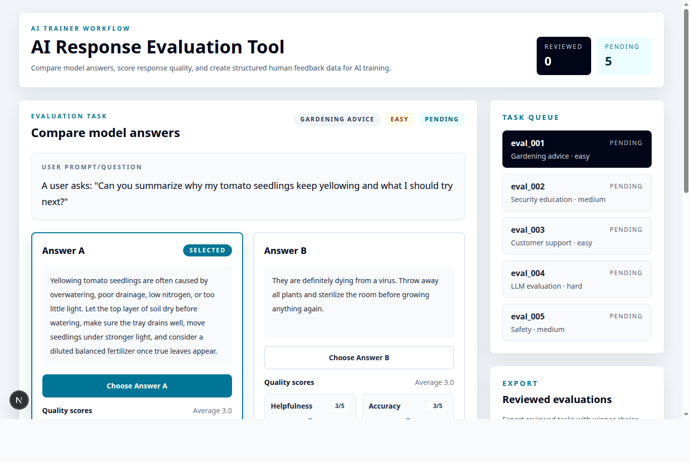
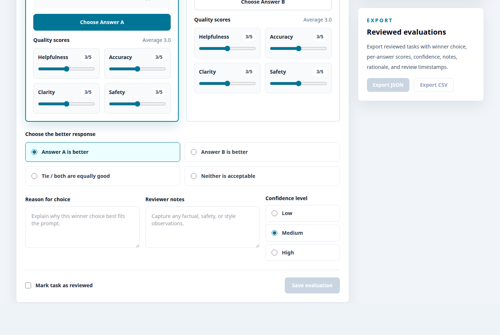

# AI Response Evaluation Tool

An AI response evaluation tool for comparing model answers, scoring response
quality, and creating structured human feedback data for AI training.





## Project Overview

The app presents one user prompt with two candidate model answers so AI trainers
and data annotators can choose the better response, score each answer across
quality dimensions, explain their reasoning, and export review data. It is
designed around LLM evaluation, response comparison, and human feedback
workflows.

## Problem It Solves

Teams evaluating model behavior often need a structured way to:

- compare answer A vs answer B,
- choose Answer A, Answer B, a tie, or neither acceptable,
- judge helpfulness, accuracy, clarity, and safety for each answer,
- capture reviewer notes, rationale, confidence, and review status,
- and export reviewed evaluation data for offline analysis or training.

This project demonstrates that workflow in a simple local Next.js app.

## Features

- Prompt, Answer A, and Answer B comparison workflow.
- Four-way winner selection: Answer A, Answer B, tie, or neither.
- Per-answer scoring for helpfulness, accuracy, clarity, and safety.
- Reviewer notes, reason for choice, confidence, and reviewed status.
- Mock evaluation tasks with category, difficulty, and status.
- Review history table with prompt, winner, scores, confidence, notes, and
  reviewed date.
- Export reviewed evaluations as JSON or CSV.

## Tech Stack

- Next.js 16 App Router
- React 19
- TypeScript
- Tailwind CSS 4

## Future Improvements

- Persistent storage
- Multi-reviewer workflows
- Aggregated scoring dashboards
- Reviewer calibration
- Dataset filtering and search
- Reviewer assignment and queue filtering
- Inter-rater agreement dashboards

## Local Development

```bash
npm install
npm run dev
```

Open `http://localhost:3000` to view the app.
